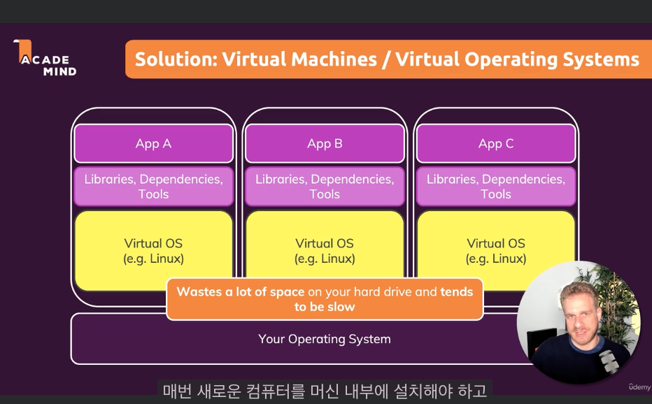
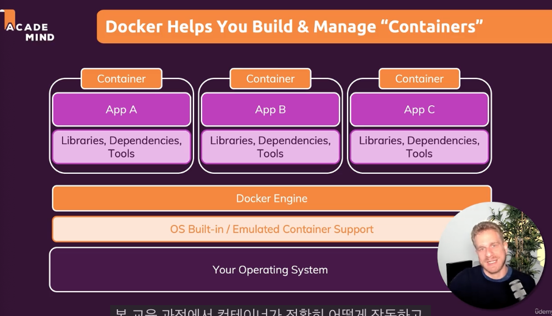

# Chapter1: 시작하기

## What is Docker? + Why?

- `도커(Docker)`: **컨테이너 기술 (컨테이너를 생성하고 관리하기 위한 도구)**
- **소프트웨어 개발에서의 컨테이너는 표준화된 소프트웨어 유닛**

  - 코드 패키지
  - 해당 코드를 실행하는데 필요한 종속성과 도구가 포함됨
  - 애플리케이션 소스코드, 런타임, 기타 도구 등이 포함된 공간

## Why Containers?

- 우리는 왜 소프트웨어 개발에서 독립적인 표준화된 애플리케이션 패키지를 원하는 것일까?
  - **다른 개발 제품 생산 환경을 가지게 된다 OR 팀/회사 내의 각각 독립적인 환경**
  - ex. Node가 14.3 버전인데 로컬 머신에만 설치되어 있는 경우 -> 리모트 서버에서 12.3 버전이라면?
  - 로컬에서 작동하던 코드가 리모트 서버에서는 작동을 안할 것이다.
  - **동일한 환경을 갖는다는 장점이 있다는 것이다.**
  - **그리고 혼자 개발할 때도 Docker가 장점이 될 수 있다.**

## Virtual Machines / Virtual Operating Systems

> **왜 꼭 Docker와 컨테이너 개념을 도입해야 할까? Docker 대신에 가상 머신과 가상 OS를 도입할 수 있는거 아닌가?**

- **OS 위에 Virtual Machine을 설치한다.**
  - `호스트 운영체제 -> 가상머신(컴퓨터 위에 컴퓨터를 설치하는 격) -> 위에 의존성, 소스코드 등 추가 가능`
  - 하지만 위의 사진에 표현된 구조는 문제가 있다.
    - 가상 운영체제를 지닌 여러 버츄얼 머신에서 발생하는 오버헤드
    - 모든 버츄얼 머신은 실제로 머신 위에서 실행되는 스탠드얼론 컴퓨터와 같다.
    - 이런게 여러개 있는 경우에는 메모리, CPU 등의 공간을 낭비하게 된다.

### 가상머신의 장단점

- 분리된 환경을 생성할 수 있고 그 안에 환경별 구성을 가질 수 있고 안정적으로 공유하고 재생산할 수 있음
- 중복 복제, 낭비되는 공간이 발생함
- 호스트 시스템위에 추가 시스템이 실행되고 있기 때문에 성능에 좋지 않음 (많으면 더 안좋음)
- 공유할 수 있는 단일 파일 구성이 없다 (머신마다 설정 파일을 수정해주어야 한다)

**위와 같은 문제들을 보완하기 위해 나온게 도커와 컨테이너이다.**

### Docker가 보완해주는 부분은?

- 하나의 머신에 몇 대의 머신을 설치하지 않는다.
- **내장 컨테이너를 이용한다.**
- **Docker Engine이 탑재됨**
- 그리고 컨테이너로 분리할 수 있는데 OS와 같은 것들을 포함하지 않는다 -> 경량화됨
- 공통적인 구성 파일을 사용해서 컨테이너를 구성할 수 있음
- **컨테이너를 이미지로 빌드하고 그 이미지를 다른 사람과 공유해서 동일한 환경을 가져가게 할 수 있다.**

### Container vs Virtual Machine

#### Container

- 운영체제와 시스템에 미치는 영향이 적다.
- 매우 빠르고 최소한의 디스크 환경을 사용함
- 이미지와 구성 파일이 있어서 공유 및 배포에 용이하다.
- 쓸데없는 부가적인 것이 없어서 경량화됨

#### Virtual Machine

- 운영체제에 많은 영향을 미침
- 속도가 느리고 디스크 공간을 더 많이 차지함
- 공유, 배포 수행할 수 있지만 컨테이너와 도커보다 까다롭다.
- 환경을 캡슐화하지만 필요한 것만이 아닌 컴퓨터 전체를 캡슐화함

## Docker Tools & Building Blocks

- `Docker Engine`: 도커를 실행하는데 필요한 Linux를 호스팅하는 가상 머신에 설정됨 (운영체제는 기본적으로 도커를 지원하지 않음)
- `Docker Desktop`
- `Docker Hub`: 클라우드, 웹에서 이미지를 호스팅해서 다른 시스템과 사람들에게 공유할 수 있게 하는 서비스
- `Docker Compose`: 도커를 기반으로 하는 도구. 복잡한 컨테이너나 다중 컨테이너를 쉽게 관리할 수 있음.

## 실습

- `FROM`: 기본 이미지 선택?
- `WORKDIR`: 컨테이너 파일 시스템에는 특정 디렉토리가 있는데 그 디렉토리를 지정해주는 것
- `EXPOSE`: 컨테이너를 노출할 건데 어떤 포트로 노출할 것인지?

- `docker build .`: Dockerfile을 가지고 이미지를 빌드함
- `docker run -p 3000:3000`: 컨테이너 실행 (-p는 컨테이너와 애플리케이션 연결 포트 지정)
- `docker ps`: 실행중인 컨테이너 리스트 조회
- `docker stop`: 컨테이너 중지 및 종료

---

## 참고자료

- https://khj93.tistory.com/entry/Docker-Docker-%EA%B0%9C%EB%85%90
